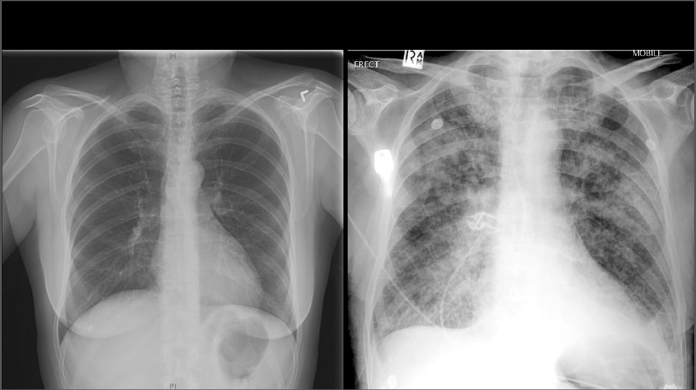
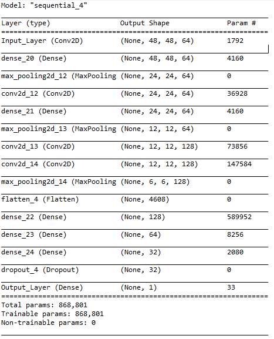
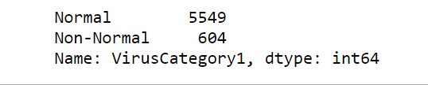
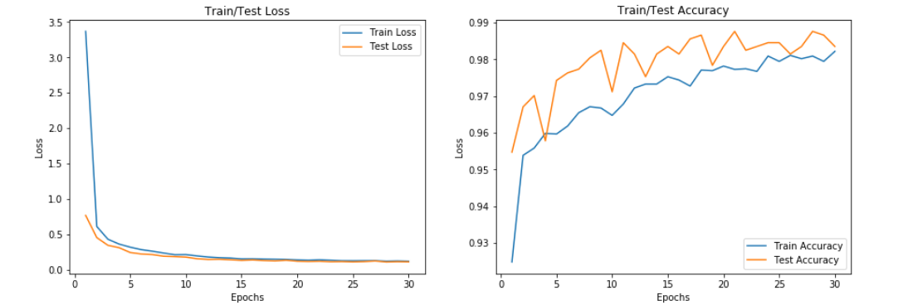
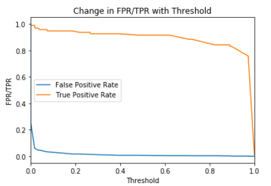
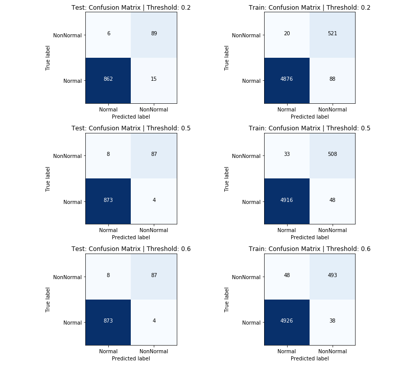
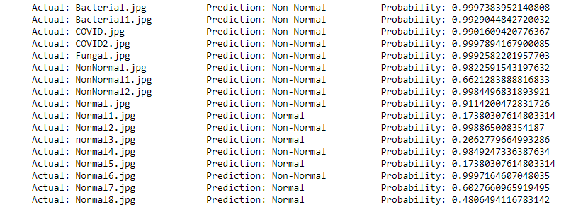

# Convolutional NN: Pneumonia Detection 

Visit [my blog](using-ai-to-detect-pneumonia-3ec4601acd07
) for a more in depth tutorial
Machine Learning/AI for predicting pneumonia given a lung x-ray image.  
## CNN Layers/Architecture
[code](CNN.ipynb)

## Train Test Split
[Code](Train_Test.ipynb)
After splitting the train and test set, the class frequencies were as follows

## Loss and Validation
[code](CNN.ipynb)

## Threshold 
[code](CNN.ipynb)

## Confusion Matrix for three thresholds
[code](CNN.ipynb)

##Test on Google Images

To test your own images, download a lung xray with the file name being its label (normal vs. non-normal) and place it in the folder [PlotImages](PlotImages)

